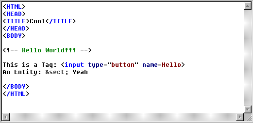



## HTML\-Syntax\-Highlighter RTF\-Textbox \(Updated\)

### Description

This is an HTML Syntax Highlighter RTF-Control. It displays Tags, Comments, Property-Names and Property-Values and most of the Entities in different colors. It can also automatically change the user's input into the right entity. E.g. the user enters "§", so my control changes it into "& s e c t ;" [Sorry, my english isn't very good...I am from germany / age: 15]
 
### More Info
 

             |
---                |---
**Submitted On**   |2000-03-04 18:46:06
**By**             |[Henning Tillmann](https://github.com/Planet-Source-Code/PSCIndex/blob/master/ByAuthor/henning-tillmann.md)
**Level**          |Intermediate
**User Rating**    |4.8 (24 globes from 5 users)
**Compatibility**  |VB 5\.0, VB 6\.0
**Category**       |[OLE/ COM/ DCOM/ Active\-X](https://github.com/Planet-Source-Code/PSCIndex/blob/master/ByCategory/ole-com-dcom-active-x__1-29.md)
**World**          |[Visual Basic](https://github.com/Planet-Source-Code/PSCIndex/blob/master/ByWorld/visual-basic.md)
**Archive File**   |[CODE\_UPLOAD3785342000\.zip](https://github.com/Planet-Source-Code/henning-tillmann-html-syntax-highlighter-rtf-textbox-updated__1-6415/archive/master.zip)

